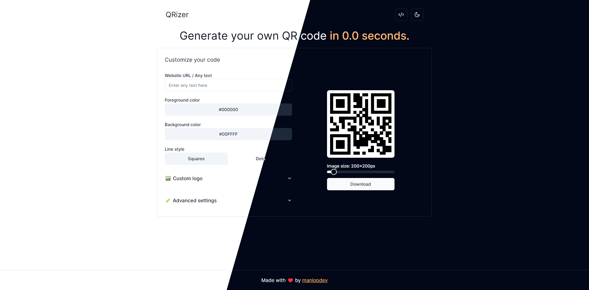

# 🖼️ QRizer: Generate your own QR code in 0.0 seconds.

## 📋 Table of contents

1. [💡 Description](#description)
2. [🎓 Usage](#usage)
3. [🚀 Deploy it locally](#deploy)

## 💡 Description

QRizer is a web application that lets you create your own, and customized QR codes.

This is the actual customization range:

- Encode a website URL or any other text.
- Foreground color.
- Background color.
- Line style (Squares or Dots).
- Custom logo image.
- Error correction level.
- Quiet zone.
- QR code size.

The QR code is generated instantly after any change in the customization and it can be downloaded as a PNG file.

## 🎓 Usage

The steps that have to be followed in order to create the code are quite simple:

1. Enter the website URL (or any text) you want to encode.
2. Customize your code based on your needs.
3. Press download... and that is it! 🎉

## 🚀 Deploy it locally

In order to deploy this web application locally:

1. Clone this repository: `git clone https://github.com/manlopdev/QRizer.git`
2. Enter the root folder: `cd QRizer`
3. Install all the dependencies: `npm install`
4. Run the project: `npm run dev`
5. Access `http://localhost:3000/`
